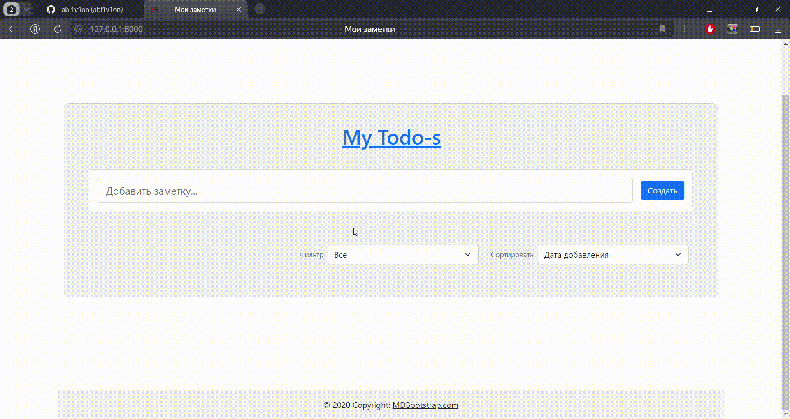

# Example

# Endpoints

1. ### Get JWT token
    ~~~
        POST token/

        data: {
            "email": str,
            "password": str
        }
    ~~~
2. ### Refresh token
    ~~~
        POST token/refresh/

        data: {
            "refresh": str
        }
    ~~~
3. ### Create new user
    ~~~
        POST users/

        data: {
            "username": str,
            "email": str,
            "password": str,
            "password2": str
        }
    ~~~
4. ### Get user notes
    ~~~
        GET notes/

        headers: {
            "Authorize": {access_token}
        }
    ~~~
5. ### Create new note
    ~~~
        POST notes/

        headers: {
            "Authorize": {access_token}
        }
        
        data: {
            "name": str
        }
    ~~~
6. ### Get note by id
    ~~~
        GET notes/{note_id}/

        headers: {
            "Authorize": {access_token}
        }
    ~~~
7. ### Delete note
    ~~~
        DELETE notes/{note_id}/

        headers: {
            "Authorize": {access_token}
        }
    ~~~
    it will be replenished...

# Docker

~~~
sudo docker-compose up
~~~

Switch to `http://0.0.0.0:1337/` or `http://127.0.0.1:1337/`
